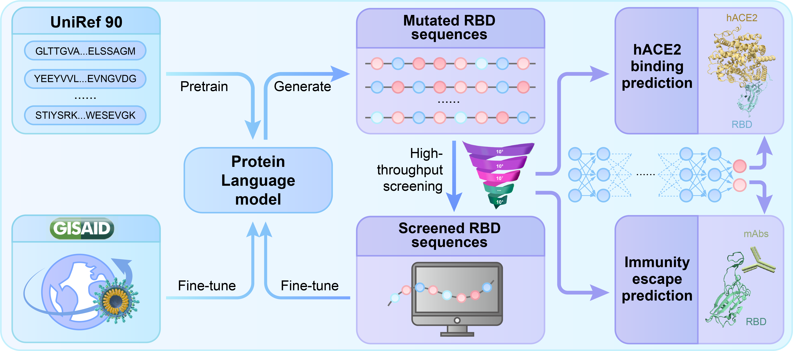

<br/>
<h1 align="center">ACM Gordon Bell COVID 2022 Finalist</h1>
<br/>

This is the official implement of our work "[Running ahead of evolution - AI based simulaion for predicting future high-risk SARS-CoV-2 variants](https://journals.sagepub.com/doi/abs/10.1177/10943420231188077)".
**A PDF version of the published paper can be downloaded from [here](https://github.com/ZhiweiNiepku/SARS-CoV-2_mutation_simulation/blob/main/IJHPCA_online.pdf).**

In order to catch up with the intricate evolution of the virus in real time, we develop a protein language model ProtFound based on AI and HPC to carry out mutation simulations of multiple lineages.
Our method paves the way for simulating coronavirus evolution in order to prepare for a future pandemic that will inevitably take place.




## Requirements
[mindspore](https://www.mindspore.cn/en) >=1.6.

## Prepare data
- Download [UniRef90](https://www.uniprot.org/help/downloads/) dataset.
- Convert downloaded data to txt files in which a line means a sequence.
```
.your_data_dir
  ├─01.txt
  ...
  └─09.txt
```

- Convert data to mindrecord data

```
python prepare_data.py --data_url your_data_dir --save_dir your_save_dir
```
for more details, see [google-bert](https://github.com/google-research/bert).

## Pretrain model

```
python run_pretrain.py --enable_modelarts True
```
Note: This code only tested on Pengcheng Cloud2. If you want run it on your own machine, you need do some modification

## Pretrained Models Availability
[Download](https://zenodo.org/record/7417029#.Y5b-x7JByBQ) 

## Generate mutations

```
python generate_mutation.py --generate_number 1000 --rbd_name wild_type --load_checkpoint_path pretrained_ckpt_path
```
## Acknowledgments
This repository is based on Mindspore official BERT code. For more details [see](https://github.com/mindspore-ai/models/tree/master/official/nlp/Bert).
